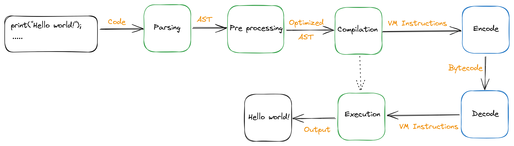

# Compilation flow

As any decent language, Dreamberd v4 follows a strict process to ensure the quality of its compilation, to
throw helpful errors when needed and optimize the processed code as much as possible to ensure maximal performance.

Here's the whole flow:

## Parsing

From a given code, the parser will create an [Abstract Syntax Tree](https://en.wikipedia.org/wiki/Abstract_syntax_tree) that represents statements and expressions in a dedicated structure instead of standard code.\
This part will also throw errors in case some syntax isn't recognized, so you'll know it right away 🔥

## Pre processing

Once the AST is generated, we perform some optimizations on it to reduce future computation and improve performance.\
This includes imports resolution, function [hoisting](https://developer.mozilla.org/en-US/docs/Glossary/Hoisting) and literal values reduction (`1 + 2` will become `3` directly) 🚀

## Compilation

Time to use this AST!\
This step will produce instructions that can be understood by the execution VM.\
Additional checks are performed to ensure everything is in order (variable names could be `undefined` for example) 🧐

## Encode / Decode

Those steps are marked in 🔵 to represent the fact that they are optional.\
Indeed, using the `run` sub-command of our `glados` binary you can skip this part.

But if you want to have a file containing some bytecode representing the compiled code, you can with those steps!\
They will be retrieved as they were before and ready to go to the next and final step 😄

## Execution

VM instructions are ready to be used, and this step will conclude the process by outputting the result of all these instructions.\
It can still throw runtime errors (in case of mismatched types for example) 🏃
